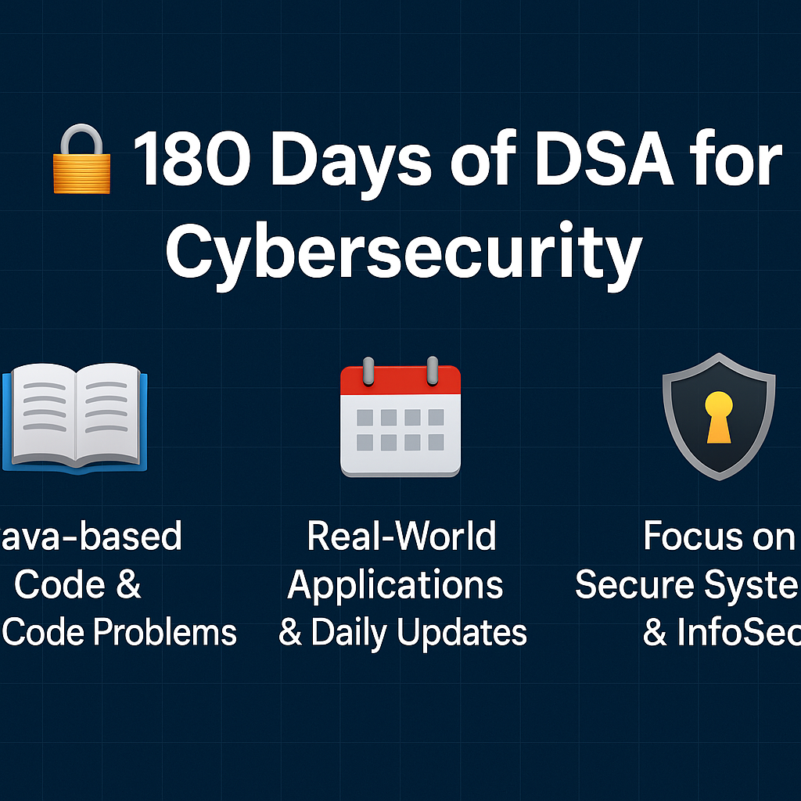

# 🔐 180 Days of DSA for Cybersecurity

Welcome to my **180-day journey** to master **Data Structures and Algorithms (DSA)** using **Java**, with a special focus on **Cybersecurity applications**. This repository will be updated **daily** with code, explanations, and real-world analogies that connect DSA concepts to InfoSec principles.

---

## 🚀 Why This Journey?

Understanding **how memory works**, **how data flows**, and **how to optimize logic** is fundamental for writing secure systems, analyzing vulnerabilities, and building tools in cybersecurity.

---

## 📌 What You’ll Find Here:

- ✅ Java code for each DSA concept
- 🛡️ Cybersecurity insights related to each topic
- 🔗 LeetCode problems with optimized solutions
- 📚 Real-world analogies for better understanding
- 💡 Time and space complexity analysis
- 🧠 Secure coding practices

---

## 📅 Day-Wise Progress

| Day | Topic | Problem | LeetCode Link | Concepts |
|-----|-------|---------|----------------|----------|
| 1   | Arrays | Two Sum | [🔗](https://leetcode.com/problems/two-sum/) | HashMap, O(n) optimization |
| 2   | Arrays | Best Time to Buy and Sell Stock | [🔗](https://leetcode.com/problems/best-time-to-buy-and-sell-stock/) | One pass, max profit logic |
| 3   | Arrays | Contains Duplicate | [🔗](https://leetcode.com/problems/contains-duplicate/) | Set for duplication check |
| ... | ...   | ...     | ...            | ...      |

> ✅ **This table will be updated daily!**

---

## 📖 How to Use This Repo

1. Clone or fork this repo.
2. Navigate to the daily folder:  
   `cd Day-01`  
3. Run the code using any Java IDE or CLI:  
   `javac Main.java && java Main`
4. Read comments for learning insights.

---

## 📚 Topics Covered

- Arrays
- Strings
- Linked Lists
- Stacks & Queues
- Trees & Graphs
- Recursion & Backtracking
- Greedy, Sliding Window, and more
- Cybersecurity-relevant DSA use cases

---

## 🔗 Follow My Journey

📌 **Daily LinkedIn Posts**  
Follow me on [LinkedIn](www.linkedin.com/in/arushmishra) for reflections, real-world examples, and interactive discussions using **#180DaysOfDSA**.

📌 **Live GitHub Repo**  
[github.com/yourusername/180-days-dsa-cybersecurity](https://github.com/Arush7376/180-days-dsa-cybersecurity)

---

## 📫 Let’s Connect!

If you're also learning DSA or interested in InfoSec, feel free to:
- Collaborate
- Share suggestions
- Open PRs for alternative solutions!

Let's learn together. 💻🔐  
#StaySecure #KeepCoding

